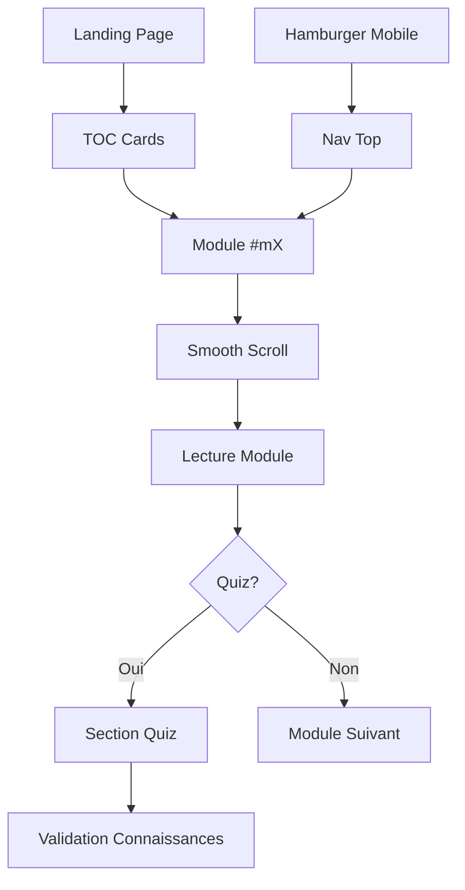

# Structure - Mémo DevOps Expert

## 📐 Architecture Générale

### Type de projet
**Site web statique monolithique** (Single Page Application sans framework)

### Philosophie
- **Simplicité** : 1 fichier HTML contenant tous les modules (pas de build step)
- **Performance** : Zéro JavaScript framework, chargement instantané
- **Portabilité** : Fonctionne sur n'importe quel serveur web statique

---

## 📂 Arborescence

```
devops/
│
├── index.html           # Page principale (3058 lignes)
│   ├── <head>          # SEO, meta tags, structured data
│   ├── <header>        # Navigation sticky avec hamburger mobile
│   ├── <hero>          # Titre et intro
│   ├── <toc>           # Table des matières (cards cliquables)
│   ├── <section#m0>    # Module 00 : Réseaux & Cloud
│   ├── <section#m1>    # Module 01 : Culture DevOps
│   ├── <section#m2>    # Module 02 : Git
│   ├── <section#m3>    # Module 03 : CI
│   ├── <section#m4>    # Module 04 : CD
│   ├── <section#m5>    # Module 05 : Docker
│   ├── <section#m6>    # Module 06 : Kubernetes
│   ├── <section#m7>    # Module 07 : IaC
│   ├── <section#m8>    # Module 08 : Observabilité
│   ├── <section#m9>    # Module 09 : DevSecOps
│   ├── <section#m10>   # Module 10 : SRE
│   ├── <section#quiz>  # Quiz interactif
│   └── <footer>        # Crédits
│
├── style.css            # Styles (1499 lignes)
│   ├── :root           # Variables CSS (couleurs, tokens)
│   ├── Global styles   # Reset, typography, containers
│   ├── Header/Nav      # Navigation + hamburger responsive
│   ├── Hero            # Section d'accueil
│   ├── TOC             # Table des matières
│   ├── Sections        # Styles modules
│   ├── Components      # Code blocks, cards, tooltips
│   ├── Responsive      # Media queries (mobile/tablet)
│   └── Interactive     # Vocab modal, simulateur
│
├── script.js            # Logique interactive (190 lignes)
│   ├── Mobile Menu     # Toggle hamburger nav
│   ├── K8s Tooltips    # Composants interactifs K8s
│   ├── Deployment Sim  # Simulateur Rolling/Blue-Green/Canary
│   ├── SLO Calculator  # Calculateur de downtime
│   └── Vocab Modal     # Système de définitions popup
│
├── quiz_devops.json     # Questions quiz (1388 lignes, 115q)
│   ├── meta            # Titre, total questions
│   └── questions[]     # Tableau de questions/réponses
│
├── icon.svg             # Favicon SVG (scalable)
├── icon.webp            # Favicon WebP 512x512
├── social-share.webp    # Image partage social 1200x630
│
├── readme.md            # Documentation projet
├── about.md             # Philosophie et contexte
├── structure.md         # Ce fichier
└── changelog.md         # Historique versions
```

---

## 🎨 Design System

### Variables CSS (`:root`)

```css
:root {
    /* Couleurs primaires */
    --primary: #68a063;         /* Vert DevOps */
    --primary-bright: #83cd29;  /* Vert lumineux */
    --secondary: #303030;       /* Gris foncé */
    
    /* Backgrounds */
    --bg: #222222;              /* Fond principal */
    --bg2: #2b2b2b;             /* Fond secondaire */
    --card: #303030;            /* Cartes */
    
    /* Texte */
    --text: #f0f0f0;            /* Texte principal */
    --muted: #a0a0a0;           /* Texte secondaire */
    --border: #444444;          /* Bordures */
    
    /* Syntax Highlighting */
    --kw: #c792ea;              /* Keywords (purple) */
    --fn: #82aaff;              /* Functions (blue) */
    --str: #c3e88d;             /* Strings (green) */
    --num: #f78c6c;             /* Numbers (orange) */
    --c: #546e7a;               /* Comments (gray) */
    --var: #ffcb6b;             /* Variables (yellow) */
}
```

### Breakpoints Responsive

```css
/* Mobile First */
@media (max-width: 768px) {
    /* Navigation hamburger */
    /* 1 colonne pour TOC */
    /* Padding réduit */
}

@media (min-width: 769px) and (max-width: 1024px) {
    /* Tablet : 2-3 colonnes TOC */
}

@media (min-width: 1025px) {
    /* Desktop : Navigation horizontale */
}
```

---

## 🧩 Composants Récurrents

### 1. **Module Structure**
Chaque module suit le modèle :
```html
<section id="mX">
    <div class="container">
        <div class="sec-header">
            <div class="sec-num">XX</div>
            <div>
                <h2 class="sec-title">Titre</h2>
                <p class="sec-sub">Sous-titre</p>
            </div>
        </div>
        
        <div class="analogy-box">Analogie</div>
        <div class="module-intro">Pourquoi ?</div>
        <div class="knowledge-box">Le saviez-vous ?</div>
        
        <!-- Contenu pédagogique -->
        <h3>A. Concept 1</h3>
        <div class="grid2">Cards</div>
        
        <h3>B. Concept 2</h3>
        <table class="cmd-table">...</table>
        
        <div class="case-study">Cas d'étude</div>
        <div class="recall-box">À retenir</div>
    </div>
</section>
```

### 2. **Vocabulary Terms**
```html
<span class="vocab-term" data-def="Définition complète">
    Terme
</span>
```
Au clic → Modal avec définition

### 3. **Code Blocks**
```html
<div class="code">
    <div class="code-head">
        <div class="dot r"></div>
        <div class="dot y"></div>
        <div class="dot g"></div>
        <span>filename.ext</span>
    </div>
    <pre><code>
        <span class="kw">keyword</span>
        <span class="fn">function</span>()
    </code></pre>
</div>
```

### 4. **Interactive Cards**
```html
<div class="tool-card">
    <h4>Outil</h4>
    <p>Description</p>
</div>
```
Hover → Transform + border color change

---

## 🔄 Flux de Navigation



---

## 📊 Statistiques Techniques

| Métrique | Valeur |
|----------|--------|
| **HTML** | 3058 lignes |
| **CSS** | 1499 lignes |
| **JavaScript** | 190 lignes |
| **JSON (Quiz)** | 1388 lignes |
| **Modules** | 11 |
| **Questions Quiz** | 115 |
| **Components CSS** | ~40 classes |
| **Variables CSS** | 15 |
| **Taille totale** | ~200 KB (non compressé) |
| **Load time** | <1s (4G) |
| **Dependencies** | 2 (Google Fonts, Quiz Engine) |

---

## 🔮 Modularisation Future (Proposition)

### Objectif
Améliorer la maintenabilité en séparant chaque module dans un fichier dédié.

### Structure Proposée
```
devops/
├── src/
│   ├── modules/
│   │   ├── m00-reseaux.html
│   │   ├── m01-culture.html
│   │   ├── m02-git.html
│   │   ├── m03-ci.html
│   │   ├── m04-cd.html
│   │   ├── m05-docker.html
│   │   ├── m06-kubernetes.html
│   │   ├── m07-iac.html
│   │   ├── m08-observabilite.html
│   │   ├── m09-devsecops.html
│   │   └── m10-sre.html
│   ├── header.html
│   ├── toc.html
│   └── footer.html
│
├── build.js           # Script de build
├── package.json       # Dependencies (si Node)
└── index.html         # Fichier généré (output)
```

### Build Script (Node.js)
```javascript
// build.js
const fs = require('fs');
const path = require('path');

const modules = [
    'header', 'toc',
    'm00-reseaux', 'm01-culture', 'm02-git',
    'm03-ci', 'm04-cd', 'm05-docker',
    'm06-kubernetes', 'm07-iac', 'm08-observabilite',
    'm09-devsecops', 'm10-sre',
    'footer'
];

let html = '<!DOCTYPE html>\n<html lang="fr">\n';
modules.forEach(mod => {
    const content = fs.readFileSync(`src/modules/${mod}.html`, 'utf8');
    html += content + '\n';
});
html += '</html>';

fs.writeFileSync('index.html', html);
console.log('✅ Build complete: index.html');
```

### Avantages
- ✅ **Clarté** : 1 fichier = 1 module (~250 lignes au lieu de 3000)
- ✅ **Git diffs** : Modifications isolées par module
- ✅ **Collaboration** : Plusieurs personnes peuvent travailler simultanément
- ✅ **Réutilisation** : Modules exportables pour d'autres projets

### Inconvénients
- ❌ **Build step** : Nécessite `npm run build` avant déploiement
- ❌ **Complexité** : Plus de fichiers à gérer
- ❌ **Dev workflow** : Changement d'habitude (watch mode requis)

### Décision
**Pour l'instant : Monolithe**  
Tant que le site reste géré par une seule personne, le gain de modularisation ne justifie pas la complexité ajoutée. Proposition gardée pour évolution future si collaboration ou croissance significative du contenu.

---

## 🔗 Dépendances Externes

| Ressource | Type | URL | Rôle |
|-----------|------|-----|------|
| **Google Fonts** | CDN | fonts.googleapis.com | Outfit + JetBrains Mono |
| **Quiz Engine** | Local | ../assets/js/quiz-engine.js | Moteur de quiz |
| **Quiz Styles** | Local | ../assets/css/quiz-style.css | Styles quiz |

> **Note** : Le site fonctionne même si Google Fonts est bloqué (fallback system fonts)

---

## 🎯 Principes d'Architecture

1. **Progressive Enhancement** : Le site fonctionne sans JS (navigation, lecture)
2. **Mobile First** : CSS responsive par défaut
3. **Semantic HTML** : Balises `<section>`, `<article>`, `<header>`, `<nav>`
4. **Accessibility** : ARIA labels sur hamburger, contrastes respectés
5. **Performance** : CSS/JS inline minimisé, images WebP optimisées
6. **SEO** : Structured data, meta tags, headings hiérarchiques

---

*Cette structure a été conçue pour être simple, maintenable et performante.*
