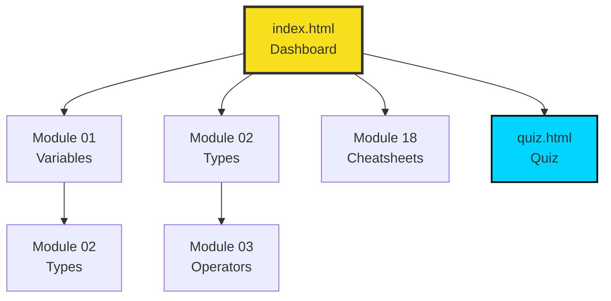

# Structure Technique du Projet

Ce document détaille l'architecture du site Mémo JavaScript, son organisation, et les conventions de développement.

## 📂 Arborescence Complète

```
javascript/
│
├── 📄 index.html                 # Page d'accueil (Dashboard modules)
├── 📄 quiz.html                  # Page du quiz interactif
├── 📊 quiz_js.json               # Base de données des questions (100 QCM)
│
├── 📝 readme.md                  # Documentation principale
├── 📝 about.md                   # Présentation détaillée du projet
├── 📝 structure.md               # Ce fichier (architecture)
├── 📝 changelog.md               # Historique des versions
├── 📝 ANALYSIS_FOR_AI.md         # Notes d'analyse pour IA (dev)
│
├── 📁 assets/                    # Ressources statiques
│   │
│   ├── 📁 css/                   # Feuilles de style
│   │   ├── style.css             # Styles globaux + Design System
│   │   ├── prism.css             # Coloration syntaxique (Prism.js)
│   │   ├── prism-overrides.css   # Customisation Prism
│   │   └── quiz-style.css        # Styles spécifiques au quiz
│   │
│   ├── 📁 js/                    # Scripts JavaScript
│   │   ├── layout.js             # Injection Header/Footer dynamique
│   │   ├── prism.js              # Bibliothèque Prism (syntax highlighting)
│   │   ├── quiz-engine.js        # Moteur du quiz (logique QCM)
│   │   └── 📁 modules/           # Scripts par module (01_variables.js, etc.)
│   │       ├── 01_variables.js
│   │       ├── 02_types.js
│   │       └── ...
│   │
│   └── 📁 images/                # Assets visuels
│       ├── favicon.svg           # Icône du site (SVG)
│       ├── favicon-*.png         # Favicons PNG (16, 32, 192, 512px)
│       ├── js-hero.webp          # Illustration hero (optionnelle)
│       └── js-og-image.webp      # Image Open Graph (1200x630px)
│
└── 📁 modules/                   # Pages des 18 modules de cours
    ├── 01_variables.html
    ├── 02_types.html
    ├── 03_operators.html
    ├── 04_conditions.html
    ├── 05_loops.html
    ├── 06_functions.html
    ├── 07_arrays.html
    ├── 08_objects.html
    ├── 09_dom.html
    ├── 10_events.html
    ├── 11_async.html
    ├── 12_fetch.html
    ├── 13_storage.html
    ├── 14_spread.html
    ├── 15_classes.html
    ├── 16_utils.html
    ├── 17_strings.html
    └── 18_cheatsheets.html
```

---

## 🏗️ Architecture et Patterns

### 1. Multi-Page Application (MPA)

Le site est une **MPA statique** : chaque module est une page HTML indépendante. Ce choix garantit :
- ✅ SEO optimal (une URL par page)
- ✅ Partage direct de modules spécifiques
- ✅ Performance (pas de bundle JS lourd)
- ✅ Simplicité de maintenance

### 2. Layout Dynamique via JavaScript

Pour éviter la duplication du Header/Footer, le fichier `layout.js` :
1. Détecte si la page est à la racine ou dans `/modules/`
2. Injecte le HTML du Header au début du `<body>`
3. Injecte le Footer à la fin du `<body>`
4. Gère les chemins relatifs automatiquement

**Extrait de `layout.js` :**
```javascript
const isModule = window.location.pathname.includes('/modules/');
const rootPath = isModule ? '../' : './';

const headerHTML = `
  <header>
    <div class="container header-content">
      <a href="${rootPath}index.html" class="logo">...</a>
      <nav>
        <a href="${rootPath}modules/01_variables.html">Variables</a>
        <!-- ... -->
      </nav>
    </div>
  </header>
`;

document.body.insertAdjacentHTML('afterbegin', headerHTML);
```

### 3. Design System (CSS Variables)

Toutes les couleurs et spacings sont centralisés dans `style.css` via des **variables CSS**.

#### Palette de Couleurs

```css
:root {
  /* Couleurs principales */
  --primary: #f7df1e;    /* Jaune JavaScript */
  --secondary: #323330;  /* Gris foncé */
  --accent: #00d4ff;     /* Cyan */
  
  /* Fonds */
  --bg: #0a0d12;         /* Fond principal (body) */
  --bg2: #0f141c;        /* Fond secondaire (details) */
  --card: #141a24;       /* Cartes/blocs */
  
  /* Textes */
  --text: #e8f0ff;       /* Texte principal */
  --muted: #8ba3c7;      /* Texte secondaire */
  --dim: #5a7094;        /* Texte tertiaire */
  
  /* Bordures */
  --border: #1e2a3a;
  
  /* Couleurs sémantiques */
  --green: #10b981;      /* Succès */
  --red: #ef4444;        /* Erreur */
  --orange: #f59e0b;     /* Warning */
  --purple: #a855f7;     /* Syntaxe */
  --pink: #ec4899;       /* Syntaxe */
}
```

#### Règle Stricte

**❌ INTERDIT :** `background: #ffffff;`, `color: #000000;`  
**✅ OBLIGATOIRE :** `background: var(--card);`, `color: var(--text);`

Permet le changement de thème global sans toucher au code HTML.

---

## 🎨 Composants Réutilisables

### Bloc de Code

```html
<div class="code">
  <div class="code-head">
    <span class="dot r"></span>
    <span class="dot y"></span>
    <span class="dot g"></span>
    Syntaxe
  </div>
  <pre><code class="language-javascript">
    // Code ici (Prism.js appliqué automatiquement)
  </code></pre>
</div>
```

### Accordéon (Details/Summary)

```html
<details>
  <summary>🔍 Titre du bloc dépliable</summary>
  <div class="details-content">
    <p>Contenu caché par défaut...</p>
  </div>
</details>
```

### Démo Interactive

```html
<div class="demo">
  <div class="demo-title">🔬 Démo Titre</div>
  <button class="demo-btn" onclick="maFonction()">Action</button>
  <div class="demo-output" id="output">Résultat...</div>
</div>
```

### Boxes (Info/Tip/Warning)

```html
<!-- Info -->
<div class="info">
  <strong>ℹ️ Info :</strong> Message informatif
</div>

<!-- Conseil -->
<div class="tip">
  <strong>💡 Astuce :</strong> Conseil pratique
</div>

<!-- Warning -->
<div class="warning">
  <strong>⚠️ Attention :</strong> Point de vigilance
</div>
```

---

## 🔄 Flux de Navigation



Chaque module propose :
- Bouton **← Dashboard** (retour à l'index)
- Bouton **Suivant →** (module suivant)

---

## 📊 Quiz Engine

Le quiz fonctionne via un moteur JavaScript (`quiz-engine.js`) qui :
1. Charge `quiz_js.json` (fetch)
2. Sélectionne 10 questions aléatoires (ou par thème)
3. Affiche les QCM avec boutons radio
4. Valide les réponses et affiche les scores
5. Propose une explication pour chaque question

**Format JSON :**
```json
[
  {
    "id": 1,
    "question": "Quelle est la différence entre let et const ?",
    "options": ["...", "...", "..."],
    "correct": 1,
    "explanation": "const ne peut pas être réassigné..."
  }
]
```

---

## 🚀 Déploiement

### Local (Développement)

Le site est 100% statique, donc n'importe quel serveur HTTP fonctionne :

```bash
# Python
python -m http.server 8000

# Node.js
npx http-server -p 8000

# PHP (si installé)
php -S localhost:8000
```

### Production (Docker + Nginx)

**Dockerfile :**
```dockerfile
FROM nginx:alpine
COPY . /usr/share/nginx/html
EXPOSE 80
```

**Build & Run :**
```bash
docker build -t memo-js .
docker run -d -p 80:80 memo-js
```

**Coolify (Orchestration) :**
- Repository GitHub poussé
- Coolify détecte le Dockerfile
- Build automatique à chaque commit
- Déploiement sur VPS Hostinger (hylst.fr)

---

## 🧪 Conventions de Code

### HTML
- Sémantique HTML5 (`<section>`, `<article>`, `<nav>`)
- IDs uniques et descriptifs (`#demo-scope`, `#output-var`)
- Classes réutilisables du Design System

### CSS
- Mobile-first (media queries `@media (min-width: ...)`)
- Variables CSS obligatoires (pas de hardcode)
- BEM-like pour les composants spécifiques

### JavaScript
- ES6+ uniquement (arrow functions, const/let, spread, etc.)
- Vanilla JS (pas de jQuery ou framework)
- Commentaires explicatifs pour les fonctions
- Scripts modulaires (un fichier par module quand nécessaire)

---

## 📈 Évolutions Architecturales Futures

- [ ] Service Worker pour mode offline
- [ ] LocalStorage pour sauvegarder la progression
- [ ] Système de thème clair/sombre (toggle)
- [ ] Composants Web Components pour réutilisabilité
- [ ] Build step avec Vite (minification/bundling optionnel)

---

*Document de référence - Version 1.0 - 31 janvier 2026*
